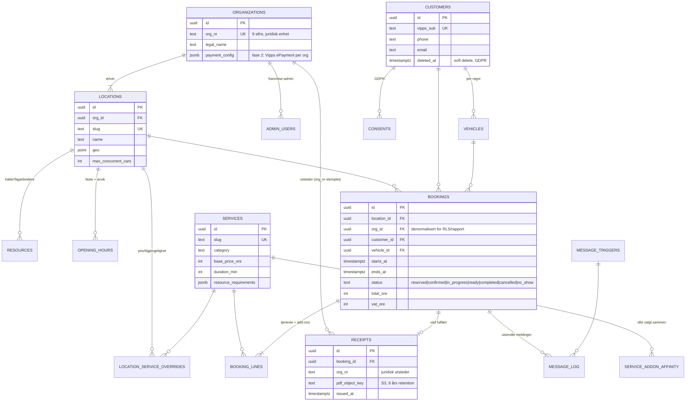

# Implementasjonsplan — Handz On Auto Care digital plattform

**Versjon 1.0 · juli 2026 · Konfidensiell — internt arbeidsdokument (ikke kundevendt tilbud)**

Sporbarhet: alle FR/NFR-referanser peker til [`KRAV.md`](./KRAV.md).

---

## Innhold

1. [Arkitektur og hovedbeslutninger](#1-arkitektur-og-hovedbeslutninger)
2. [Teknologivalg med begrunnelse](#2-teknologivalg-med-begrunnelse)
3. [Datamodell — multi-tenant med juridisk skille](#3-datamodell--multi-tenant-med-juridisk-skille)
4. [Integrasjonskart](#4-integrasjonskart)
5. [Kapasitetslogikk (spor B — egen bookingmotor)](#5-kapasitetslogikk-spor-b--egen-bookingmotor)
6. [Sikkerhet, personvern og GDPR](#6-sikkerhet-personvern-og-gdpr)
7. [Drift, hosting og kostnadsbilde](#7-drift-hosting-og-kostnadsbilde)
8. [Fremdriftsplan mot lansering september 2026](#8-fremdriftsplan-mot-lansering-september-2026)
9. [Fastprismatrise](#9-fastprismatrise)
10. [Risikoregister og fase 2-klargjøring](#10-risikoregister-og-fase-2-klargjøring)

---

## 1. Arkitektur og hovedbeslutninger

### 1.1 Modulith, ikke microservices

Én deploybar applikasjon med rene domenemoduler (marked, booking, kunde, kommunikasjon,
admin) + PostgreSQL + Redis. Ved 15 lokasjoner og ~500 bookinger/dag (5–15 k ordrer/mnd) er
dette objektivt riktig:

- **Minst kompleksitet**: ingen nettverksgrenser mellom moduler, ett deploy-artefakt, én logg.
- **Minst drift**: to små noder + backup dekker hele plattformen (kap. 7).
- **Billigst**: fastpris-infra ~400–700 kr/mnd (kap. 7.3).
- **Ikke en blindvei**: modulene kommuniserer via interne grensesnitt og domenehendelser.
  Kommunikasjonsmotoren kjører allerede som egen worker-container; booking- eller admin-modulen
  kan skilles ut til egne tjenester senere uten omskriving hvis volumet noen gang krever det.

```
[Cloudflare: CDN + WAF + DDoS (gratis/Pro)]
        │
[Hetzner Cloud EU (Falkenstein/Helsinki), Docker via Coolify]
  ├─ Next.js 16-app (SSR/ISR marked + booking + Min side)
  │    └─ Payload CMS innebygd (selvhostet, gratis, admin-UI, data i egen Postgres)
  │    └─ Domenelag m/ adapter: [Spor A: Avio-API] / [Spor B: egen bookingmotor]
  ├─ Worker-container: BullMQ (SMS/e-post-triggere, påminnelser, post-checkout)
  ├─ PostgreSQL 16 (egen node, PITR-backup → Hetzner Object Storage)
  └─ Redis (cache, kø, rate limiting)
Eksterne: Vipps Logg inn (OIDC) · SVV regnr-oppslag · Sveve/LINK SMS · Resend e-post
          · Google Maps · Meta/Google Consent Mode v2
```

### 1.2 Port/adapter for booking — spor A og spor B (FR-3.1)

Avio-tilgang (MYO0/ED/POS-API) er uavklart. All bookinglogikk programmeres derfor mot ett
grensesnitt — `BookingAdapter` — med to implementasjoner:

| | Spor A — Avio | Spor B — egen bookingmotor |
|---|---|---|
| Kalender/kapasitet | Leses fra Avio | Beregnes selv (kap. 5) |
| Ordre | Skrives til Avio (POS er master) | Egen `bookings`-tabell er master |
| Kvittering | Fra Avio POS | Genereres selv (PDF, org.nr-stemplet) |
| Risiko | API-tilgang, rate limits, feltdekning | Mer utviklingsarbeid, dobbeltvedlikehold ved POS-bytte |

Grensesnittet finnes allerede i demoen (`lib/booking-adapter.ts`) med `MockBookingAdapter`
som tredje implementasjon (demo/test). **Beslutningspunkt:** se risikoregister (kap. 10) —
Avio-avklaring er kritisk sti og må lukkes innen utgangen av fase 1.

### 1.3 Demoen i dette repoet

Repoet inneholder en kjørbar demo (mobil først, mørk premium-profil) som viser forside,
avdelingssider, hele 7-stegs bookingflyten og Min side — alt på `MockBookingAdapter` og mock-
SVV, uten database. Demoen er referanseimplementasjon for UX og for adapter-grensesnittet;
produksjonsoppsettet (Payload, Postgres, BullMQ, ekte integrasjoner) etableres i utviklingsfasen.

## 2. Teknologivalg med begrunnelse

Styrende prinsipp: **billigst og mest effektivt over tid** — fastpris fremfor usage-fakturering,
selveid fremfor SaaS, ingen innlåsing (NFR-8).

| Område | Valg | Hvorfor / forkastet |
|---|---|---|
| Språk | TypeScript i hele stacken | Ett språk for web, backend-logikk, worker og evt. app (React Native). Go/C# forkastet: splitter kompetanse uten gevinst på denne lasten |
| Frontend | Next.js 16 (App Router, SSR/ISR), self-hosted standalone i Docker | Best SSR/ISR for Lighthouse ≥ 90 (NFR-2), størst talent-pool, deler React-kode med evt. app. Astro forkastet (bookingflyt er app-aktig), SvelteKit forkastet (mindre økosystem/talent) |
| CMS (FR-1.3) | Payload CMS 3, innebygd i Next.js-appen, data i egen Postgres | Gratis og selvhostet — ingen per-seat SaaS-kostnad, full dataeierskap, admin-UI følger med. Sanity forkastet: løpende lisens + data hos tredjepart |
| Database | PostgreSQL 16, selvdriftet på egen Hetzner-node | Håndterer volumet med stor margin i årevis; fastpris ~100–200 kr/mnd. Multi-tenant via `org_id` på alle rader + row-level security (kap. 3.3). Supabase/Neon forkastet: usage-prising + innlåsing |
| Kø/jobber | Redis + BullMQ i egen worker-container | Gratis, selvhostet, retries/idempotens/forsinkede jobber innebygd (FR-5.3). QStash/Vercel Cron forkastet (usage-priset, innlåsing) |
| Hosting | Hetzner Cloud EU + Coolify (Docker-deploy m/ CI/CD), Cloudflare foran | ~400–700 kr/mnd totalt, fastpris, EU-dataresidens (NFR-4), null innlåsing. Vercel forkastet (usage-kost ved vekst), Azure forkastet (5–10× pris for samme last) |
| Filer | Hetzner Object Storage (S3-kompatibelt API) | PDF-kvitteringer 6 år (bokføringsloven, FR-4.4), lifecycle-regler, bucket-prefiks per org.nummer |
| Auth (FR-2.2/FR-4.1) | Vipps Logg inn (OIDC) via Auth.js v5 + passordløs OTP (SMS/e-post); httpOnly secure cookies | Vipps er de facto standard i Norge. Keycloak forkastet: driftstung overkill for to innloggingsmetoder |
| Regnr (FR-2.1.2) | SVV «Enkeltoppslag i motorvognregisteret» (gratis REST-API, API-nøkkel) | Offisiell kilde; auto-uppercase/trim + `inputmode`-tastatur i UI; manuell fallback (NFR-3) |
| SMS/E-post (FR-5.3) | Sveve eller LINK Mobility (SMS, norsk avsendernavn) + Resend (e-post) | Trigges fra BullMQ-domenehendelser; leverandør bak eget `MessageProvider`-grensesnitt så bytte er trivielt |
| Kart (FR-1.2) | Google Maps Platform (statisk kart + lenker; JS-API kun der det trengs) | Gratiskvoten dekker normal trafikk; forenklet i demo |
| Samtykke (NFR-4) | Consent Mode v2 (Google/Meta) m/ egen samtykkebanner | Kreves for annonsemåling i EU |
| App (opsjon) | PWA inkludert i web; native = Expo (React Native), gjenbruker API + designtokens | Prises som fastpris-opsjon (kap. 9) |

## 3. Datamodell — multi-tenant med juridisk skille

### 3.1 Prinsipp (NFR-6, FR-5.1)

Hver av de 15 franchisetakerne er egen juridisk enhet med eget org.nummer. Alt økonomisk
(ordre, kvittering, bokføringsdata, fremtidige betalingsavtaler) må derfor være entydig knyttet
til én `organization`. Kjeden eier felles tjenestekatalog, merkevare og innhold; avdelingene
overstyrer pris/tilgjengelighet lokalt (FR-5.2).

### 3.2 ERD



Øvrige tabeller: `admin_users` (rolle: `chain_super_admin` | `franchise_admin` | `employee`,
scopet til org), `resources` (hall/fagarbeider m/ kapabiliteter), `opening_hours`
(ukemønster + datounntak), `consents` (formål, tidspunkt, kilde), `message_triggers`
(hendelse → mal → kanal → forsinkelse), `message_log` (idempotensnøkkel, status, leverandør-ref),
`audit_log` (hvem så/endret persondata, NFR-5).

### 3.3 Håndheving av tenant-skille

- Alle rader som kan knyttes til en juridisk enhet bærer `org_id`; PostgreSQL **row-level
  security** aktiveres med policy `org_id = current_setting('app.org_id')` for franchise-admin-
  sesjoner. Kjede-superadmin bruker egen rolle som omgår policyen.
- Kvitteringer genereres med utstedende org.nummer, juridisk navn og adresse i dokumentet, og
  lagres under `receipts/{org_nr}/{år}/`-prefiks med 6 års object-lock (bokføringsloven § 13).
- Ved «Slett meg» (FR-4.5) anonymiseres kunderaden, men kvitteringer og bokføringspliktige
  ordredata beholdes til retention utløper (hjemmel: bokføringsloven; kommuniseres i flyten).

## 4. Integrasjonskart

| Integrasjon | Retning | Protokoll | Feilhåndtering (NFR-3) |
|---|---|---|---|
| **Avio MYO0/ED/POS** (spor A) | Begge | REST (avklares) | Retry m/ backoff; ved nede: les fra siste synkroniserte kapasitetscache, kø ordre-skriving; sirkuitbryter |
| **Vipps Logg inn** | Inn | OIDC (Auth.js) | Fallback: OTP via SMS/e-post |
| **SVV motorvognregister** | Ut | REST enkeltoppslag | Ved feil/timeout (>2 s): manuell inntasting av merke/modell — booking stopper aldri |
| **Kundeklubb/medlemsregister** | Ut | REST (avklares) | **Fallback til standard prisliste** (FR-5.4/NFR-3); medlemsrabatt etterberegnes ev. i etterkant |
| **Sveve/LINK (SMS)** | Ut | REST | BullMQ-retry (5×, eksponentiell backoff), idempotensnøkkel per melding, DLQ m/ varsling |
| **Resend (e-post)** | Ut | REST | Som SMS; e-post er sekundærkanal |
| **Google Maps** | Ut | Statisk/JS-API | Kart degraderer til adresseliste + lenke |
| **Consent Mode v2** | Ut | gtag/pixel | Uten samtykke: ingen sporing, siden fungerer fullt |

### Kommunikasjonsmotor (FR-5.3)

Domenehendelser (`booking.confirmed`, `booking.reminder_24h`, `booking.reminder_2h`,
`booking.ready`, `booking.completed`, `customer.inactive_90d`) publiseres til BullMQ.
Worker-containeren konsumerer, slår opp aktiv `message_trigger` (redigerbar mal per kanal i
Payload-admin), renderer og sender. Alle utsendelser logges i `message_log` med
idempotensnøkkel `{booking_id}:{trigger}` slik at retry aldri dobbelsender.

## 5. Kapasitetslogikk (spor B — egen bookingmotor)

Tilgjengelige tidsluker for tjeneste *T* ved avdeling *L* på dato *D* (FR-2.1.4):

1. **Åpningsvindu**: faste åpningstider for *L* på *D*, minus datounntak (helligdager, avvik).
2. **Ressursmatrise**: *T* krever ressurstyper (f.eks. 1 hall + 1 fagarbeider m/ kapabilitet
   «polering»). Kandidatluker = tidsrom der minst ett komplett ressurssett er ledig
   sammenhengende i `duration_min(T, L)` + buffer før/etter (rigg/tørk, konfigurerbart per tjeneste).
3. **Samtidighetstak**: antall overlappende bookinger < `max_concurrent_cars(L)`.
4. **Granularitet**: luker rastreres til 30 min; siste start = stengetid − varighet − buffer.
5. **Reservasjon**: valgt luke holdes i 10 min (Redis-lås `SETNX` m/ TTL) fra steg 4 til
   fullført steg 6, så to kunder ikke booker samme ressurssett. Bekreftelse skriver booking
   transaksjonelt med konfliktkontroll (exclusion constraint på ressurs × tidsrom).

Algoritmen er O(bookinger den dagen) per forespørsel og cachebar per (L, T, D) med
invalidering ved ny booking. `MockBookingAdapter` i demoen genererer luker etter samme modell
(åpningstid, varighet, kapasitet) med deterministisk pseudotilfeldighet.

## 6. Sikkerhet, personvern og GDPR

### 6.1 Sikkerhet (NFR-5)

- TLS 1.3 ende til ende (Cloudflare strict + origin-sertifikat), HSTS.
- CSP og security headers (nonce-basert script-policy, `frame-ancestors 'none'`).
- All input valideres med zod på server; parameteriserte spørringer (ingen streng-SQL).
- Rate limiting i Redis (per IP + per identitet) på booking-, OTP- og oppslagsendepunkter.
- Webhook-signering (HMAC) for innkommende kall; utgående hemmeligheter i Coolify-vault.
- RLS/org-scoping på alle spørringer (kap. 3.3); audit-logg på lesing/endring av persondata.
- OWASP ASVS L2 som sjekkliste i kodegjennomgang; avhengighets-skanning (npm audit/Renovate).
- OS: unattended-upgrades; Coolify- og imageoppdateringer månedlig (driftsavtale).
- Ekstern pentest før lansering; funn P1/P2 lukkes før go-live.

### 6.2 Personvern (NFR-4)

- EU-dataresidens for all persondata (Hetzner DE/FI, Cloudflare EU-only-modus vurderes).
- Databehandleravtaler (DPA): Hetzner, Cloudflare, Sveve/LINK, Resend, Google, Vipps.
- Samtykker registreres per formål i `consents`; Consent Mode v2 styrer all markedssporing.
- «Slett meg» (FR-4.5): selvbetjent; anonymiserer kundedata umiddelbart, bokføringspliktige
  bilag beholdes til 6-årsfristen per org (kommuniseres tydelig i flyten).
- Dataminimering: regnr + kontaktinfo er kjernen; ingen unødvendige felter.
- Behandlingsprotokoll og DPIA-utkast leveres som del av fase 5.

### 6.3 Backup og gjenoppretting (NFR-7)

- PostgreSQL: kontinuerlig WAL-arkivering (PITR) til Hetzner Object Storage + nattlig full dump.
  RPO ≤ 5 min, RTO ≤ 2 t. **Månedlig restore-test** til isolert node, dokumentert i driftslogg.
- Object Storage: versjonering + object-lock på kvitteringer.
- Coolify-konfig og infrastruktur som kode i git.

## 7. Drift, hosting og kostnadsbilde

### 7.1 Oppsett

| Komponent | Spesifikasjon |
|---|---|
| App-node | Hetzner CPX31 (4 vCPU/8 GB) — Next.js-app + worker + Redis (Docker via Coolify) |
| DB-node | Hetzner CPX21 (3 vCPU/4 GB) — PostgreSQL 16, privat nett mot app-noden |
| Lagring | Hetzner Object Storage — backup + kvitterings-PDF |
| Kant | Cloudflare — DNS, CDN, WAF, DDoS, bot-beskyttelse |
| Deploy | Coolify: git push → bygg → helsesjekk → zero-downtime bytte; rollback = forrige image |
| Overvåking | Uptime Kuma (ekstern uptime + sertifikat), Grafana/Loki/Prometheus (metrikker + logg), varsling til Slack/SMS |

### 7.2 Skalering og exit

Ved vekst: CPX31 → CPX41/51 (vertikalt, minutter), les-replika for rapportering, worker på egen
node. Exit-plan (NFR-8): alt er Docker + Postgres + S3-API — kan flyttes til enhver leverandør
med `pg_dump` + `rclone` + DNS-bytte på under en dag.

### 7.3 Kostnadstabell (månedlig, eks. mva)

| Post | Kostnad |
|---|---|
| Hetzner app-node CPX31 | ~150 kr |
| Hetzner DB-node CPX21 | ~90 kr |
| Object Storage + backup-trafikk | ~80 kr |
| Cloudflare (Free → Pro ved behov) | 0–250 kr |
| **Sum infrastruktur (fastpris)** | **~400–700 kr** |
| SMS (volumavhengig, ~0,35–0,60 kr/stk) | ~500–1 200 kr |
| Resend + Google Maps (innenfor kvoter ved normal trafikk) | 0–300 kr |

Sammenlignet med Vercel + Supabase + Sanity-stack (~2 000–8 000 kr/mnd og stigende med volum):
**besparelse ~100 000–400 000 kr over 5 år**, uten innlåsing.

## 8. Fremdriftsplan mot lansering september 2026

| Fase | Innhold | Periode | Milepæl |
|---|---|---|---|
| 1 | Avklaringer og fundament: Avio-dialog (spor A/B-beslutning), design-system, innholdsmodell, miljøoppsett (Coolify/Postgres/CI) | juli 2026 | **Beslutningspunkt Avio senest 31. juli** |
| 2 | Markedsnettside: forside, tjenester, avdelingssider, CMS (Payload), SEO-grunnmur | aug uke 1–2 | Innhold redigerbart av kjeden |
| 3 | Bookingflyt: 7 steg, SVV-integrasjon, valgt spor (A/B), Vipps/OTP-innlogging | aug uke 1–3 (parallelt) | Ende-til-ende booking i staging |
| 4 | Min side + kommunikasjonsmotor: portal, kvitteringer, SMS/e-post-triggere | aug uke 3–4 | Full kundereise i staging |
| 5 | Herding: pentest, GDPR-leveranser, Lighthouse-optimalisering, restore-test, pilot på 2 avdelinger | sep uke 1–2 | Go/no-go |
| 6 | Lansering: utrulling alle 15 avdelinger, opplæring franchise-admin, hypercare 2 uker | sep uke 3–4 | **Lansert september 2026** |

Kritisk sti: Avio-avklaringen (fase 1) → bookingflyt (fase 3). Spor B-bygging starter uansett
med adapter-grensesnittet, så en sen Avio-avklaring forsinker ikke UX-arbeidet.

## 9. Fastprismatrise

Alle priser eks. mva. Fastpris — timepris eksponeres ikke.

| Leveranse | Innhold | Pris |
|---|---|---|
| **Web-plattform (spor A)** | Markedsnettside + CMS, 7-stegs booking mot Avio, Min side, kommunikasjonsmotor, multi-tenant admin, GDPR-leveranser, lansering | **650 000–850 000 kr** |
| **Påslag spor B** | Egen bookingmotor: kapasitetslogikk, ressursstyring, kvitteringsgenerering, admin-kalender | **+250 000–350 000 kr** |
| **Opsjon: native app** | Expo/React Native (iOS + Android), gjenbruk av API og designtokens; push-varsler | **+150 000–250 000 kr** |
| **Drift og forvaltning** | Infrastruktur, overvåking 24/7-varsling, patching, backup m/ restore-test, SLA (99,5 %, responstid P1 < 4 t), 2 t endringsarbeid/mnd | **8 000–15 000 kr/mnd** |

Endelig punktpris settes etter Avio-avklaring og omfangslåsing; spennene reflekterer
usikkerhet i integrasjonsdekning og innholdsproduksjon.

## 10. Risikoregister og fase 2-klargjøring

### 10.1 Risikoregister

| # | Risiko | S×K | Tiltak |
|---|---|---|---|
| 1 | **Avio API-tilgang uavklart** (spor A umulig eller mangelfull) | Høy×Høy | Adapter-mønster; beslutningspunkt 31. juli; spor B ferdig priset og planlagt; UX-arbeid uavhengig av spor |
| 2 | Kapasitetsmodell matcher ikke virkeligheten (overbooking/tomgang) | Med×Høy | Pilot på 2 avdelinger i fase 5; buffere konfigurerbare per avdeling; manuell overstyring i admin |
| 3 | SVV-API endrer vilkår/kvoter | Lav×Med | Manuell fallback finnes (NFR-3); caching av oppslag |
| 4 | Innholdsproduksjon fra 15 franchisetakere forsinkes | Med×Med | CMS-maler + sentral standardtekst; avdelingssider fungerer med kjedeinnhold alene |
| 5 | GDPR-funn sent i løpet | Lav×Høy | DPIA i fase 1–2, ikke fase 5; DPA-liste vedlikeholdes løpende |
| 6 | Nøkkelpersonavhengighet i drift | Med×Med | Infrastruktur som kode, runbooks, Coolify-standardoppsett |

### 10.2 Fase 2-klargjøring

Datamodellen og adapterlaget er forberedt for:

- **Vipps ePayment per org.nummer**: `organizations.payment_config` holder MSN/API-nøkler per
  juridisk enhet; betalingsstrøm og oppgjør går da direkte til riktig franchisetaker.
- **Nøkkelskap**: `booking.status`-maskinen har allerede `ready`-tilstand; nøkkelskap-hendelser
  (innlevering/henting) kobles på som integrasjonsadapter + meldingstriggere.
- **Dekkhotell**: egen modul med `vehicles`-kobling (lagringsplass, sesongbytte-booking
  gjenbruker kapasitetslogikken).
- **Kundeklubb v2**: medlemsnivåer og priser via `location_service_overrides`-mekanismen.
